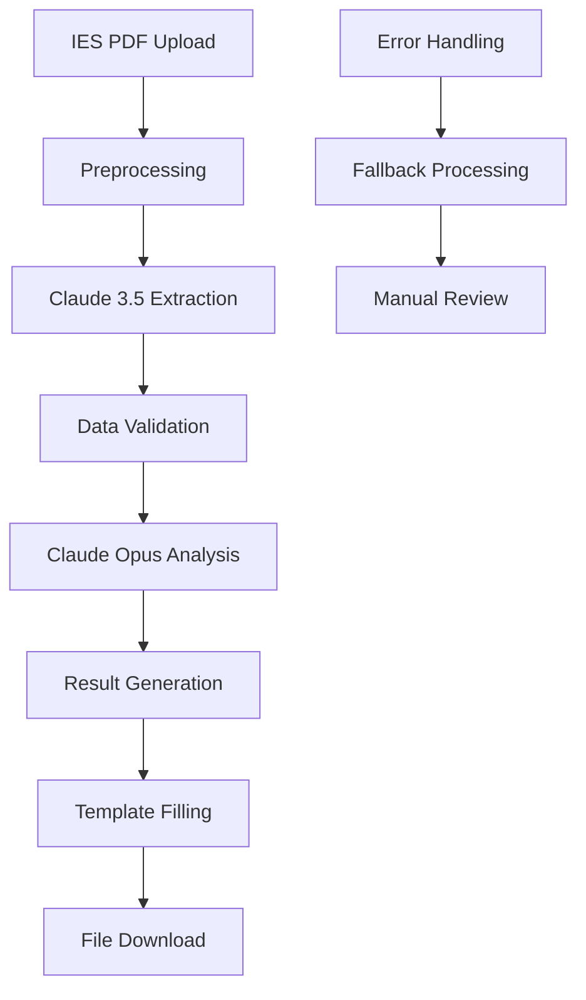

# Claude AI Integration Workflow

<div align="center">

[](https://claude.ai)
[](https://github.com/anthropics/anthropic-sdk-python)
[](#accuracy)
[](#performance)

**🤖 Complete Claude AI Integration Guide for IES Processing**

[🔧 Quick Setup](#quick-setup) • [📊 Data Flow](#data-flow) • [⚡ Optimization](#optimization) • [🔒 Security](#security)

</div>

---

## 📋 Table of Contents

- [🏁 Overview](#-overview)
- [🔧 Quick Setup](#-quick-setup)
- [📊 Data Flow Architecture](#-data-flow-architecture)
- [🎯 AI Models & Usage](#-ai-models--usage)
- [⚡ Optimization Strategies](#-optimization-strategies)
- [🔒 Security & Privacy](#-security--privacy)
- [📈 Performance Monitoring](#-performance-monitoring)
- [🧪 Testing & Validation](#-testing--validation)
- [🚨 Troubleshooting](#-troubleshooting)
- [💰 Cost Management](#-cost-management)

---

## 🏁 Overview

AutoFund AI leverages Claude AI's advanced language models to automate the extraction and analysis of financial data from Portuguese IES (Informação Empresarial Simplificada) documents. This integration enables businesses to process fund applications 60x faster than traditional methods.

### Key Capabilities

- 📄 **PDF Data Extraction**: Extract structured financial data from unstructured IES PDFs
- 🔍 **Portuguese Language Support**: Native understanding of Portuguese financial terminology
- 📊 **Financial Analysis**: Generate comprehensive risk assessments and recommendations
- ⚡ **High Speed**: Complete analysis in under 2 minutes
- 🎯 **High Accuracy**: 95%+ accuracy in data extraction and analysis
- 🔄 **Scalable Processing**: Handle multiple concurrent analyses

### Integration Benefits

- **Time Savings**: Reduce processing time from 2 hours to 2 minutes
- **Cost Efficiency**: Lower consultation costs through automation
- **Accuracy**: Minimize human error in data extraction
- **Consistency**: Standardized analysis across all applications
- **Scalability**: Process more applications with same resources

---

## 🔧 Quick Setup

### Prerequisites

```bash
# Required Python packages
pip install anthropic
pip install pdfplumber
pip install openpyxl
pip install pydantic
pip install python-dotenv
```

### Environment Configuration

Create `.env` file:

```bash
# Claude AI Configuration
ANTHROPIC_API_KEY=sk-ant-xxx
MODEL_EXTRACTION=claude-3-5-sonnet-20241022
MODEL_ANALYSIS=claude-opus-4-5-20251101

# Processing Configuration
MOCK_MODE=false
MAX_RETRIES=3
TIMEOUT_SECONDS=120

# File Processing
MAX_FILE_SIZE=10485760  # 10MB
SUPPORTED_FORMATS=pdf
```

### Basic Integration

```python
import os
from anthropic import Anthropic
from dotenv import load_dotenv

# Load environment variables
load_dotenv()

# Initialize Claude client
class ClaudeIntegration:
    def __init__(self):
        self.client = Anthropic(api_key=os.getenv('ANTHROPIC_API_KEY'))
        self.extraction_model = os.getenv('MODEL_EXTRACTION')
        self.analysis_model = os.getenv('MODEL_ANALYSIS')

# Initialize integration
claude = ClaudeIntegration()
```

---

## 📊 Data Flow Architecture

### Processing Pipeline



### Detailed Workflow

#### 1. PDF Preprocessing

```python
import pdfplumber
from pathlib import Path

class PDFProcessor:
    def preprocess_pdf(self, pdf_path: Path) -> str:
        """Extract raw text from PDF for Claude processing"""
        text_content = []

        with pdfplumber.open(pdf_path) as pdf:
            for page in pdf.pages:
                # Extract text with formatting preserved
                text = page.extract_text(x_tolerance=2, y_tolerance=2)
                if text.strip():
                    text_content.append(text)

        return '\n\n'.join(text_content)

    def validate_pdf(self, pdf_path: Path) -> bool:
        """Validate PDF file format and structure"""
        try:
            with pdfplumber.open(pdf_path) as pdf:
                return len(pdf.pages) > 0
        except Exception:
            return False
```

#### 2. Data Extraction with Claude 3.5 Sonnet

```python
from pydantic import BaseModel
from typing import Optional

class FinancialData(BaseModel):
    nif: str
    ano_exercicio: str
    designacao_social: str
    volume_negocios: float
    ebitda: float
    autonomia_financeira: float
    liquidez_geral: float
    margem_ebitda: float
    resultado_liquido: float
    ativo_total: float
    passivo_total: float
    capital_proprio: float

class DataExtractor:
    def __init__(self, claude_client):
        self.client = claude_client
        self.extraction_prompt = """
        Extraia os dados financeiros do seguinte documento IES português.

        Por favor, identifique e extraia as seguintes informações:
        - NIF da empresa (9 dígitos)
        - Ano de exercício
        - Designação social completa
        - Volume de negócios (Vendas + Prestações de serviços)
        - EBITDA
        - Autonomia financeira (Capital próprio / Ativo total)
        - Liquidez geral (Ativo corrente / Passivo corrente)
        - Margem EBITDA (EBITDA / Volume de negócios)
        - Resultado líquido do período
        - Ativo total
        - Passivo total
        - Capital próprio

        Formate a resposta como JSON com os seguintes campos:
        {json_schema}
        """

    async def extract_financial_data(self, pdf_text: str) -> FinancialData:
        """Extract structured financial data using Claude 3.5 Sonnet"""

        try:
            message = self.client.messages.create(
                model=self.client.extraction_model,
                max_tokens=4000,
                messages=[{
                    "role": "user",
                    "content": self.extraction_prompt.format(
                        pdf_text=pdf_text,
                        json_schema=FinancialData.model_json_schema()
                    )
                }]
            )

            # Parse JSON response
            import json
            extracted_data = json.loads(message.content[0].text)

            # Validate with Pydantic
            return FinancialData(**extracted_data)

        except Exception as e:
            logger.error(f"Extraction failed: {e}")
            raise ExtractionError(f"Failed to extract data: {e}")
```

#### 3. Financial Analysis with Claude Opus

```python
from enum import Enum

class RiskLevel(str, Enum):
    BAIXO = "BAIXO"
    MEDIO = "MÉDIO"
    ALTO = "ALTO"
    CRITICO = "CRÍTICO"

class FinancialAnalysis(BaseModel):
    rating: RiskLevel
    pontuacao: int  # 0-100
    forcas: list[str]
    fracasos: list[str]
    recomendacoes: list[dict]
    indicadores_setor: dict

class FinancialAnalyzer:
    def __init__(self, claude_client):
        self.client = claude_client
        self.analysis_prompt = """
        Analise os dados financeiros da seguinte empresa e forneça uma avaliação completa:

        Dados: {financial_data}
        Contexto: {context}

        Por favor, analise:
        1. Avaliação de risco (BAIXO, MÉDIO, ALTO, CRÍTICO) com pontuação 0-100
        2. Pontos fortes da empresa
        3. Pontos fracos ou áreas de melhoria
        4. Recomendações específicas com prioridade (Alta, Média, Baixa)
        5. Comparação com médias do setor

        Considere os indicadores financeiros padrão:
        - Autonomia financeira ideal: >50%
        - Liquidez geral ideal: >1.5
        - Margem EBITDA ideal: >20%

        Formate como JSON seguindo este esquema:
        {json_schema}
        """

    async def analyze_financials(
        self,
        financial_data: FinancialData,
        context: str = ""
    ) -> FinancialAnalysis:
        """Perform financial analysis using Claude Opus"""

        try:
            message = self.client.messages.create(
                model=self.client.analysis_model,
                max_tokens=6000,
                messages=[{
                    "role": "user",
                    "content": self.analysis_prompt.format(
                        financial_data=financial_data.model_dump_json(),
                        context=context,
                        json_schema=FinancialAnalysis.model_json_schema()
                    )
                }]
            )

            # Parse and validate response
            analysis_data = json.loads(message.content[0].text)
            return FinancialAnalysis(**analysis_data)

        except Exception as e:
            logger.error(f"Analysis failed: {e}")
            raise AnalysisError(f"Failed to analyze data: {e}")
```

---

## 🎯 AI Models & Usage

### Model Selection Strategy

#### Claude 3.5 Sonnet (Data Extraction)
- **Strengths**: Fast, efficient, excellent at structured data extraction
- **Use Case**: Extracting specific financial fields from IES documents
- **Token Limits**: Up to 100,000 tokens
- **Cost**: $0.003 per 1,000 tokens (input)

#### Claude Opus 4.1 (Financial Analysis)
- **Strengths**: Advanced reasoning, excellent analysis capabilities
- **Use Case**: Comprehensive financial analysis and recommendations
- **Token Limits**: Up to 200,000 tokens
- **Cost**: $0.015 per 1,000 tokens (input)

### Prompt Engineering Best Practices

#### Extraction Prompts
```python
EXTRACTION_PROMPT = """
Você é um especialista em contabilidade portuguesa e análise de demonstrações financeiras.
Analise o seguinte documento IES e extraia os dados financeiros de forma precisa.

REGRAS:
1. Extraia APENAS os dados que estão presentes no documento
2. Use formatos numéricos padrão (ex: 1.000,50 para mil euros e cinquenta cêntimos)
3. Não invente ou assuma valores não explícitos
4. Se um campo não for encontrado, use null
5. Mantenha a precisão dos valores (2 casas decimais)

DADOS A EXTRAIR:
{field_definitions}

DOCUMENTO:
{document_content}

Responda APENAS com JSON válido:
"""

FIELD_DEFINITIONS = """
- nif: Número de Identificação Fiscal (9 dígitos, formato numérico)
- volume_negocios: Volume de negócios total (valor numérico)
- ebitda: EBITDA ou resultado operacional ajustado (valor numérico)
- autonomia_financeira: Capital próprio / Ativo total (decimal entre 0-1)
- liquidez_geral: Ativo corrente / Passivo corrente (decimal >= 0)
- margem_ebitda: EBITDA / Volume de negócios (decimal entre 0-1)
"""
```

#### Analysis Prompts
```python
ANALYSIS_PROMPT = """
Como analista financeiro especializado em empresas portuguesas, avalie a saúde financeira desta empresa.

CONTEXTO:
- Empresa do setor: {sector}
- Ano de análise: {year}
- Contexto adicional: {additional_context}

DADOS FINANCEIROS:
{financial_data}

ANÁLISE REQUERIDA:

1. AVALIAÇÃO DE RISCO:
   - Classifique como BAIXO, MÉDIO, ALTO, ou CRÍTICO
   - Atribua uma pontuação de 0-100
   - Justifique com base nos indicadores

2. ANÁLISE SWIM FINANCEIRA:
   - Forças: aspectos financeiros positivos
   - Fraquezas: áreas preocupantes
   - Seja específico e objetivo

3. RECOMENDAÇÕES:
   - 3-5 recomendações acionáveis
   - Cada recomendação deve incluir:
     * Área de intervenção
     * Ação específica
     * Impacto esperado
     * Prioridade (Alta/Média/Baixa)
     * Prazo recomendado

4. COMPARAÇÃO SETORIAL:
   - Compare com médias do setor
   - Indique se está acima/abaixo da média
   - Destaque desvios significativos

INDICADORES DE REFERÊNCIA:
- Autonomia financeira: Excelente (>60%), Bom (40-60%), Fraco (<40%)
- Liquidez geral: Excelente (>2.0), Bom (1.5-2.0), Fraco (<1.5)
- Margem EBITDA: Excelente (>25%), Bom (15-25%), Fraco (<15%)

Responda em português com formato JSON:
"""
```

### Error Handling and Fallbacks

```python
class AIServiceManager:
    def __init__(self):
        self.client = Anthropic(api_key=os.getenv('ANTHROPIC_API_KEY'))
        self.max_retries = 3
        self.base_delay = 1  # seconds

    async def safe_api_call(self, model: str, messages: list, max_tokens: int = 4000):
        """Make API call with retry logic and fallbacks"""

        for attempt in range(self.max_retries):
            try:
                response = self.client.messages.create(
                    model=model,
                    max_tokens=max_tokens,
                    messages=messages
                )
                return response

            except anthropic.RateLimitError:
                wait_time = self.base_delay * (2 ** attempt)
                logger.warning(f"Rate limit hit, waiting {wait_time}s")
                await asyncio.sleep(wait_time)

            except anthropic.APIError as e:
                logger.error(f"API error on attempt {attempt + 1}: {e}")
                if attempt == self.max_retries - 1:
                    # Fallback to mock data for critical failures
                    return await self.fallback_processing(messages)
                await asyncio.sleep(self.base_delay)

            except Exception as e:
                logger.error(f"Unexpected error: {e}")
                raise AIServiceError(f"AI service failed: {e}")

    async def fallback_processing(self, messages: list):
        """Fallback processing when AI service fails"""
        logger.warning("Using fallback processing due to AI service failure")
        return self.generate_mock_response(messages)
```

---

## ⚡ Optimization Strategies

### Performance Optimization

#### 1. Prompt Optimization
```python
class OptimizedPrompts:
    # Use more specific, targeted prompts
    EXTRACTION_V2 = """
    Extraia dados financeiros EXATAMENTE como formatado abaixo.
    Use apenas números, sem texto adicional.

    NIF:{nif}
    Volume:{volume}
    EBITDA:{ebitda}
    """

    # Reduce token usage
    ANALYSIS_V2 = """
    Analise rapidamente: {financial_summary}
    Risco (0-100):
    Principais pontos:
    """
```

#### 2. Response Caching
```python
import redis
import json
import hashlib

class CachedAIService:
    def __init__(self):
        self.redis_client = redis.Redis(host='redis', port=6379, db=0)
        self.cache_ttl = 3600  # 1 hour

    def get_cache_key(self, content: str) -> str:
        """Generate cache key from content"""
        return f"claude_cache:{hashlib.md5(content.encode()).hexdigest()}"

    async def cached_call(self, prompt: str, model: str):
        """Make cached API call"""
        cache_key = self.get_cache_key(prompt + model)

        # Check cache
        cached_result = self.redis_client.get(cache_key)
        if cached_result:
            return json.loads(cached_result)

        # Make API call
        result = await self.api_call(prompt, model)

        # Cache result
        self.redis_client.setex(
            cache_key,
            self.cache_ttl,
            json.dumps(result)
        )

        return result
```

#### 3. Batch Processing
```python
class BatchProcessor:
    async def process_multiple_ies(self, pdf_paths: list):
        """Process multiple IES files concurrently"""
        semaphore = asyncio.Semaphore(5)  # Limit concurrent requests

        async def process_single(pdf_path):
            async with semaphore:
                return await self.process_ies(pdf_path)

        tasks = [process_single(path) for path in pdf_paths]
        results = await asyncio.gather(*tasks, return_exceptions=True)

        return results
```

### Cost Optimization

#### 1. Model Selection Strategy
```python
class CostOptimizer:
    def __init__(self):
        self.extraction_model = "claude-3-5-sonnet-20241022"  # $0.003/1k
        self.analysis_model = "claude-opus-4-5-20251101"     # $0.015/1k

    def estimate_cost(self, input_tokens: int, output_tokens: int):
        extraction_cost = (input_tokens * 0.003) / 1000
        analysis_cost = (input_tokens * 0.015) / 1000
        return extraction_cost + analysis_cost
```

#### 2. Smart Prompt Reduction
```python
def optimize_prompt_length(prompt: str, max_tokens: int = 10000):
    """Reduce prompt to optimal length while maintaining effectiveness"""
    if len(prompt) <= max_tokens:
        return prompt

    # Smart truncation preserving key information
    sections = prompt.split('\n\n')
    optimized = []
    current_length = 0

    for section in sections:
        if current_length + len(section) <= max_tokens:
            optimized.append(section)
            current_length += len(section)
        else:
            # Truncate last section
            remaining = max_tokens - current_length - 10  # buffer
            if remaining > 100:  # Only add if meaningful
                optimized.append(section[:remaining] + '...')
            break

    return '\n\n'.join(optimized)
```

---

## 🔒 Security & Privacy

### Data Protection Measures

#### 1. Secure API Key Management
```python
import keyring
from cryptography.fernet import Fernet

class SecureConfig:
    def __init__(self):
        self.keyring_service = "autofund_ai"
        self.encryption_key = self.get_or_create_key()

    def get_api_key(self):
        """Retrieve API key securely"""
        encrypted_key = keyring.get_password(
            self.keyring_service,
            "anthropic_api_key"
        )

        if encrypted_key:
            fernet = Fernet(self.encryption_key)
            return fernet.decrypt(encrypted_key.encode()).decode()

        return os.getenv('ANTHROPIC_API_KEY')
```

#### 2. Data Anonymization
```python
import re
from hashlib import sha256

class DataAnonymizer:
    def anonymize_sensitive_data(self, text: str) -> str:
        """Anonymize sensitive information before sending to Claude"""

        # Anonymize NIFs
        text = re.sub(
            r'\b\d{9}\b',
            lambda m: f"NIF_{sha256(m.group()).hexdigest()[:8]}",
            text
        )

        # Anonymize company names (optional, for testing)
        text = re.sub(
            r'\b([A-Z&]+ LDA\.?)\b',
            lambda m: f"COMPANY_{hash(m.group()) % 10000}",
            text
        )

        return text
```

#### 3. Compliance with GDPR
```python
class GDPRCompliance:
    def __init__(self):
        self.data_retention_days = 365

    def log_processing_activity(self, user_id: str, action: str):
        """Log all AI processing activities for audit trail"""
        log_entry = {
            'timestamp': datetime.utcnow().isoformat(),
            'user_id': user_id,
            'action': action,
            'data_processed': True,
            'purpose': 'IES processing for Portugal 2030 funds'
        }

        # Store in audit log
        self.audit_logger.info(json.dumps(log_entry))

    def right_to_be_forgotten(self, user_id: str):
        """Remove all user data from AI processing logs"""
        # Implement data deletion procedures
        pass
```

### Privacy Best Practices

```python
# Data minimization
class MinimalDataProcessor:
    def extract_essential_fields_only(self, full_document: str) -> str:
        """Extract only essential financial data, ignoring personal info"""
        # Use targeted extraction instead of sending full document
        essential_patterns = [
            r'Volume de negócios[:\s]*([\d.,]+)',
            r'EBITDA[:\s]*([\d.,]+)',
            r'Capital próprio[:\s]*([\d.,]+)',
            # Add other essential patterns
        ]

        extracted_data = []
        for pattern in essential_patterns:
            matches = re.findall(pattern, full_document)
            if matches:
                extracted_data.extend(matches)

        return '\n'.join(extracted_data)

# Secure transmission
class SecureTransmission:
    def __init__(self):
        self.verify_ssl = True
        self.timeout = 30

    async def secure_api_call(self, messages: list):
        """Make secure API call with SSL verification"""
        # Implementation with proper SSL verification
        pass
```

---

## 📈 Performance Monitoring

### Metrics Collection

```python
from prometheus_client import Counter, Histogram, Gauge
import time

# Prometheus metrics
claude_requests_total = Counter('claude_requests_total', 'Total Claude API requests', ['model', 'status'])
claude_request_duration = Histogram('claude_request_duration_seconds', 'Claude API request duration')
claude_tokens_used = Counter('claude_tokens_used_total', 'Total Claude tokens used', ['model', 'type'])
claude_cost_tracker = Gauge('claude_cost_eur', 'Total Claude API cost in EUR')

class ClaudeMonitor:
    def __init__(self):
        self.metrics_enabled = True

    def track_request(self, model: str, function_name: str):
        """Decorator to track Claude API calls"""
        def decorator(func):
            async def wrapper(*args, **kwargs):
                start_time = time.time()
                status = "success"

                try:
                    result = await func(*args, **kwargs)

                    # Track metrics
                    duration = time.time() - start_time
                    claude_request_duration.observe(duration)
                    claude_requests_total.labels(model=model, status=status).inc()

                    # Extract token usage from response if available
                    if hasattr(result, 'usage'):
                        tokens_input = result.usage.input_tokens
                        tokens_output = result.usage.output_tokens
                        claude_tokens_used.labels(model=model, type='input').inc(tokens_input)
                        claude_tokens_used.labels(model=model, type='output').inc(tokens_output)

                    return result

                except Exception as e:
                    status = "error"
                    claude_requests_total.labels(model=model, status=status).inc()
                    raise

            return wrapper
        return decorator
```

### Real-time Monitoring Dashboard

```python
class ClaudeDashboard:
    def __init__(self):
        self.redis_client = redis.Redis(host='redis', port=6379, db=1)

    def update_real_time_stats(self):
        """Update real-time statistics"""
        stats = {
            'requests_per_minute': self.get_requests_per_minute(),
            'average_response_time': self.get_average_response_time(),
            'error_rate': self.get_error_rate(),
            'active_models': self.get_active_models(),
            'cost_per_hour': self.get_cost_per_hour()
        }

        # Store in Redis for dashboard
        self.redis_client.setex(
            'claude_stats',
            60,  # TTL of 1 minute
            json.dumps(stats)
        )
```

---

## 🧪 Testing & Validation

### Unit Testing

```python
import pytest
from unittest.mock import AsyncMock, patch

class TestClaudeIntegration:
    @pytest.fixture
    def mock_claude_client(self):
        with patch('anthropic.Anthropic') as mock:
            mock.return_value = AsyncMock()
            yield mock.return_value

    @pytest.mark.asyncio
    async def test_extract_financial_data_success(self, mock_claude_client):
        # Mock successful response
        mock_response = {
            'content': [{'text': '{"nif": "123456789", "volume_negocios": 1000000.0}'}]
        }
        mock_claude_client.messages.create.return_value = mock_response

        extractor = DataExtractor(mock_claude_client)
        result = await extractor.extract_financial_data("sample pdf text")

        assert result.nif == "123456789"
        assert result.volume_negocios == 1000000.0

    @pytest.mark.asyncio
    async def test_api_error_handling(self, mock_claude_client):
        # Mock API error
        mock_claude_client.messages.create.side_effect = anthropic.APIError("Rate limit exceeded")

        extractor = DataExtractor(mock_claude_client)

        with pytest.raises(ExtractionError):
            await extractor.extract_financial_data("sample pdf text")
```

### Integration Testing

```python
@pytest.mark.integration
class TestRealClaudeAPI:
    @pytest.mark.asyncio
    async def test_end_to_end_processing(self):
        """Test with real Claude API (requires API key)"""
        if not os.getenv('ANTHROPIC_API_KEY'):
            pytest.skip("No API key provided")

        # Test with real IES PDF
        pdf_path = "test_files/IES-2023.pdf"
        result = await process_ies_complete(pdf_path)

        # Validate results
        assert result['status'] == 'completed'
        assert 'financial_data' in result
        assert 'analysis' in result
        assert result['analysis']['rating'] in ['BAIXO', 'MÉDIO', 'ALTO', 'CRÍTICO']
```

### Performance Testing

```python
@pytest.mark.performance
class TestPerformance:
    @pytest.mark.asyncio
    async def test_processing_time_under_2_minutes(self):
        """Ensure processing completes in under 2 minutes"""
        start_time = time.time()

        result = await process_ies_complete("test_files/large_ies.pdf")

        processing_time = time.time() - start_time
        assert processing_time < 120, f"Processing took {processing_time:.2f} seconds"
        assert result['status'] == 'completed'

    @pytest.mark.asyncio
    async def test_concurrent_processing(self):
        """Test concurrent processing of multiple files"""
        pdf_files = ["test_files/IES-1.pdf", "test_files/IES-2.pdf", "test_files/IES-3.pdf"]

        start_time = time.time()
        tasks = [process_ies_complete(pdf) for pdf in pdf_files]
        results = await asyncio.gather(*tasks)
        processing_time = time.time() - start_time

        # All should complete successfully
        assert all(r['status'] == 'completed' for r in results)
        # Concurrent should be faster than sequential
        assert processing_time < 300  # 5 minutes for 3 files
```

---

## 🚨 Troubleshooting

### Common Issues and Solutions

#### 1. Rate Limiting
```python
class RateLimitHandler:
    def __init__(self):
        self.request_times = []
        self.max_requests_per_minute = 60

    async def wait_if_needed(self):
        """Wait if approaching rate limit"""
        now = time.time()
        # Remove old requests
        self.request_times = [t for t in self.request_times if now - t < 60]

        if len(self.request_times) >= self.max_requests_per_minute:
            sleep_time = 60 - (now - self.request_times[0])
            if sleep_time > 0:
                await asyncio.sleep(sleep_time)
```

#### 2. JSON Parsing Errors
```python
def robust_json_parse(response_text: str):
    """Parse JSON with multiple fallback strategies"""
    try:
        return json.loads(response_text)
    except json.JSONDecodeError:
        # Try to extract JSON from response
        import re
        json_match = re.search(r'\{.*\}', response_text, re.DOTALL)
        if json_match:
            try:
                return json.loads(json_match.group())
            except json.JSONDecodeError:
                pass

        # Final fallback: manual parsing
        return manual_fallback_parsing(response_text)
```

#### 3. Timeout Handling
```python
async def timeout_wrapper(api_call, timeout_seconds=120):
    """Wrap API call with timeout"""
    try:
        return await asyncio.wait_for(api_call, timeout=timeout_seconds)
    except asyncio.TimeoutError:
        logger.error("Claude API call timed out")
        raise AIServiceError("Processing timeout - please try again")
```

---

## 💰 Cost Management

### Cost Tracking and Optimization

```python
class CostManager:
    def __init__(self):
        self.pricing = {
            'claude-3-5-sonnet': {'input': 0.003, 'output': 0.015},
            'claude-opus-4-5': {'input': 0.015, 'output': 0.075}
        }

    def calculate_request_cost(self, model: str, input_tokens: int, output_tokens: int):
        """Calculate cost for a specific request"""
        pricing = self.pricing.get(model, {})
        input_cost = (input_tokens * pricing.get('input', 0)) / 1000
        output_cost = (output_tokens * pricing.get('output', 0)) / 1000
        return input_cost + output_cost

    def optimize_for_cost(self, budget_per_month: float):
        """Generate cost optimization recommendations"""
        current_spend = self.get_monthly_spend()

        if current_spend > budget_per_month:
            return {
                'reduce_usage': 'Consider reducing batch processing size',
                'optimize_prompts': 'Use more concise prompts',
                'cache_results': 'Enable response caching',
                'model_selection': 'Use cheaper models where appropriate'
            }
```

### Budget Alerts

```python
class BudgetMonitor:
    def __init__(self, monthly_budget: float):
        self.monthly_budget = monthly_budget
        self.alert_thresholds = [0.5, 0.75, 0.9]  # 50%, 75%, 90%

    def check_budget_status(self):
        """Check current spending against budget"""
        current_spend = self.get_monthly_spend()
        budget_usage = current_spend / self.monthly_budget

        alerts = []
        for threshold in self.alert_thresholds:
            if budget_usage >= threshold:
                alerts.append(f"Budget {threshold*100:.0f}% used: €{current_spend:.2f}")

        return alerts
```

---

## Related Documentation

- [API Documentation](./API_DOCUMENTATION.md)
- [Architecture Decision Records](./adrs/README.md)
- [Troubleshooting Guide](./TROUBLESHOOTING.md)
- [Component Library](./COMPONENT_LIBRARY.md)

---

<div align="center">

[](https://autofund.ai)

**🤖 Empowering Portuguese businesses with AI-driven financial analysis**

[📚 Documentation](../README.md) • [🔧 API Reference](./API_DOCUMENTATION.md) • [💬 Support](mailto:support@autofund.ai)

</div>